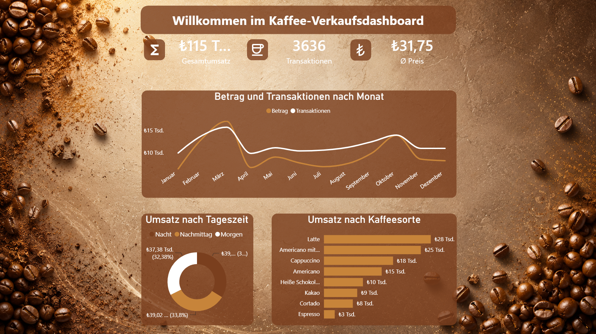

# 📖 **Dil:** [Deutsch](README.md) | **Türkçe**

# ☕ Kahve Satış Panosu

Bu proje, bir kahve işletmesine ait satış verilerini görselleştiren ve analiz eden interaktif bir Power BI panosudur. Projenin amacı, dört temel alanda anlamlı içgörüler elde etmektir: Aylık umsatz ve işlem gelişimi, günün saatine göre satış dağılımı, kahve türüne göre satış performansı ve toplam ciro, işlem sayısı ile ortalama fiyat gibi temel metrikler. Pano, satış davranışlarının esnek ve detaylı biçimde analiz edilmesine imkân sunmaktadır.

## 📸 Ekran Görüntüsü

## 🛠️ Kullanılan Araçlar

- **Power BI Desktop**
- **DAX**
- **Power Query**

## 📧 İletişim

**Süha Çağrı Özbakışlar**

